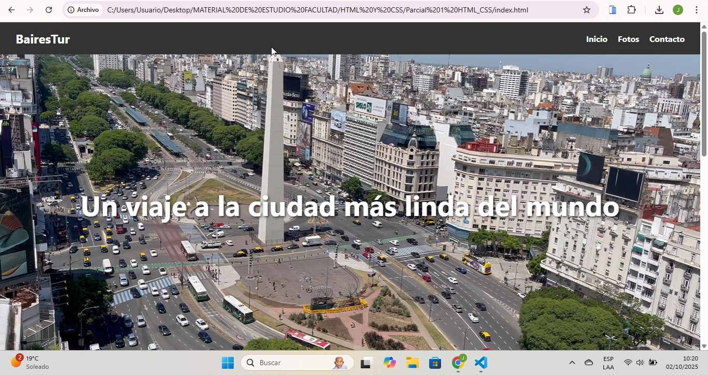

# BairesTour

BairesTour is a personal web project showcasing Buenos Aires, Argentina, its landmarks, culture, and travel tips. The site includes sections with photos, cards for notable places, travel tips, and contact information.

## Features

- Responsive design using HTML and CSS
- Photo gallery of Buenos Aires
- Cards highlighting famous landmarks: Obelisco, Caminito, Floralis Genérica
- Travel tips and interesting facts
- Contact form and footer with email and WhatsApp links

## Live Demo

Check out the live site here: [BairesTour on Vercel](https://baires-tour-web.vercel.app)

## Sample Images

Here are some sample images from the project:

|  |  |  |
|-----------------------------------------------|-----------------------------------------------|-----------------------------------------------|
|  |  |  |

